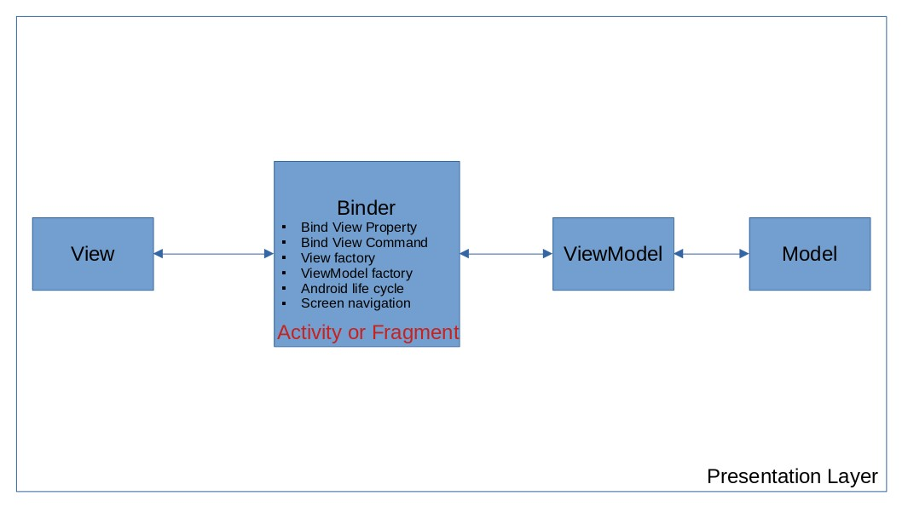

Android Template Project
---
This project is modified base on [Android Architecture Sample](https://github.com/android/architecture-samples/) with
the following changes

* Remove data-binding and use view binding only
* Business logic implemented with simple UseCase
* Implement MVVM architecture
* Custom navigator to navigate between screens
* Dependency injection with [Dagger-Hilt](https://github.com/google/dagger/)

MVVM
---
According to the definition of MVVM architecture
in [wikipedia](https://en.wikipedia.org/wiki/Model%E2%80%93view%E2%80%93viewmodel), there should be a **Binder** that
communicate between the View and its bound properties in the ViewModel. Since data-binding library is not considered in
this app, the best option for binder is android fragment as it contains both View and ViewModel factory.

* View factory: [onCreateView callback](https://developer.android.com/reference/androidx/fragment/app/Fragment#onCreateView(android.view.LayoutInflater,android.view.ViewGroup,android.os.Bundle))
* ViewModel factory:override [getDefaultViewModelProviderFactory](https://developer.android.com/reference/androidx/fragment/app/Fragment#getDefaultViewModelProviderFactory())

Based on previous statement, fragment is not View or ViewModel in MVVM architecture. However android context is needed
to achieve screen navigation on android platform that makes fragment part of ViewModel role, therefore, only allow
navigation logic in Fragment as a compromise.

Unit Test
---

* Unit test for use cases
* UI Integration unit test for each screen