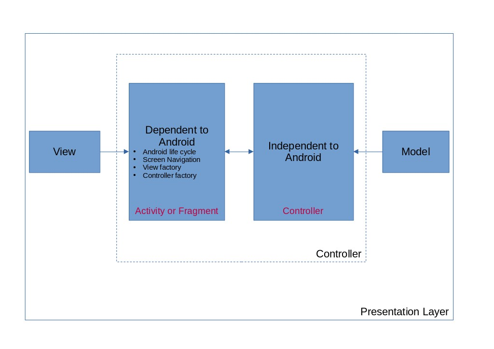

Android Template Project
---
This project is modified base on [Android Architecture Sample](https://github.com/android/architecture-samples/) with the following changes
* Remove data-binding and use view binding only
* Business logic implemented with simple UseCase
* Remove Jetpack ViewModel
* Simple MVC pattern implementation that the definition of Controller contains two parts, android related part and business logic part
* Custom navigator to navigate between screens
* Dependency injection with [Dagger-Hilt](https://github.com/google/dagger/)

TODO
---
* ~~Add Unit test for use cases~~ Completed
* ~~Add UI Integration unit test for each screen~~ Completed